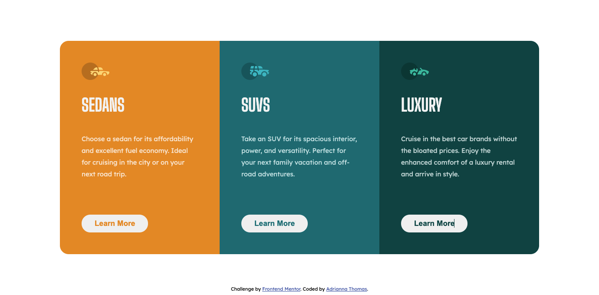

# Frontend Mentor - 3-column preview card component solution

This is a solution to the [3-column preview card component challenge on Frontend Mentor](https://www.frontendmentor.io/challenges/3column-preview-card-component-pH92eAR2-). Frontend Mentor challenges help you improve your coding skills by building realistic projects.

## Table of contents

- [Overview](#overview)
  - [The challenge](#the-challenge)
  - [Screenshot](#screenshot)
  - [Links](#links)
- [My process](#my-process)
  - [Built with](#built-with)
  - [What I learned](#what-i-learned)
  - [Continued development](#continued-development)
  - [Useful resources](#useful-resources)
- [Author](#author)
- [Acknowledgments](#acknowledgments)

## Overview

### The challenge

Users should be able to:

- View the optimal layout depending on their device's screen size
- See hover states for interactive elements

### Screenshot




### Links

- Solution URL: [Add solution URL here](https://your-solution-url.com)
- Live Site URL: [Github Page](https://adrianna-thomas.github.io/3-column-preview-card-component/)

## My process

### Built with

- Semantic HTML5 markup
- CSS custom properties
- Flexbox
- CSS Grid

### What I learned

Figured out how to make the content appear side-by-side using the grid property instead of flexbox. Made the border radius appear on the container.

```css
.wrapper {
  display: grid;
  grid-template-columns: 1fr 1fr 1fr;
  border-radius: 1rem;
  overflow: hidden;
}
```

Figured out how to make the content scroll on smaller viewpoint within a media query.

```css
@media only screen and (max-width: 375px) {
    body {
        overflow-y: scroll;
    }
```

### Continued development

Get more comfortable using rem instead of pixels.

### Useful resources

- [1](https://www.youtube.com/watch?v=5DAvEEKfTEE&ab_channel=MrCoder) - This helped me with figuring out how to get the border radius to appear. And with deciding to use grid instead of flexbox for the layout.

## Author

- Frontend Mentor - [@adrianna-thomas](https://www.frontendmentor.io/profile/adrianna-thomas)

## Acknowledgments

[Mr Coder Youtube Video](https://www.youtube.com/watch?v=5DAvEEKfTEE&ab_channel=MrCoder)
